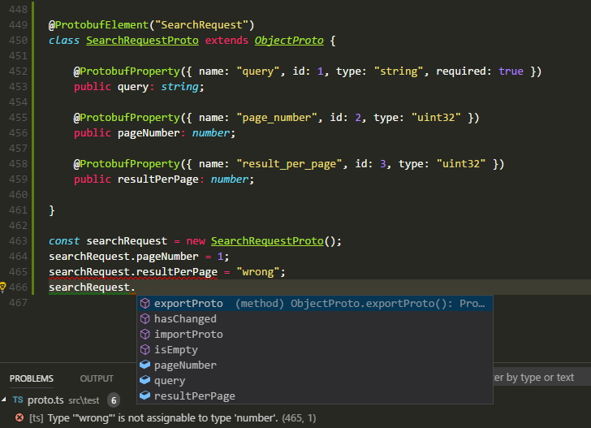

# tsprotobuf

[](https://opensource.org/licenses/MIT)
[](https://coveralls.io/github/PeculiarVentures/tsprotobuf?branch=master)
[](https://circleci.com/gh/PeculiarVentures/tsprotobuf)

## Install

```
npm install tsprotobuf
```

## Using

```javascript
const utils = require("tsprotobuf");
```

The `tsprotobuf` namespace will always be available globally and also supports AMD loaders.

Protobuf scheme:
```
message SearchRequest {
  required string query = 1;
  optional int32 page_number = 2;
  optional int32 result_per_page = 3;
}
```



## Types

There is an [index.d.ts](./index.d.ts) file which makes easy to use current module as external

## Decorators

To get more info about using decorators in TypeScript you can take information [here](https://www.typescriptlang.org/docs/handbook/decorators.html)

### ProtobufElement

Decorator for `class`

| Name | Type       | Description                                                                                  |
|------|------------|----------------------------------------------------------------------------------------------|
| name | string     | Name of scheme in Protobuf model. Optional. If name is not presents. it uses name of `class` |

#### Example

```typescript
@ProtobufElement({name: "Person"})
class PersonProto {
    // class body here
}
```

### ProtobufProperty

Decorator for class properties

| Name         | Type       | Description                                                                                  |
|--------------|------------|----------------------------------------------------------------------------------------------|
| name         | string     | Name of property in Protobuf schema                                                          |
| id           | number     | Index of property in Protobuf message                                                        |
| required     | boolean    | Determines if property is required                                                           |
| type         | string     | Protobuf simple type. `bytes`, `uint32`, `bool`, etc. Default value is `bytes`               |
| converter    | IConverter | Converter for difficult data                                                                 |
| defaultValue | any        | Default value for property                                                                   |
| parser       | typeof ObjectProto | Parser class for child Protobuf messages                                             |

#### Example 1

Simple Protobuf message

Protobuf scheme:
```
message SearchRequest {
  required string query = 1;
  optional int32 page_number = 2;
  optional int32 result_per_page = 3;
}
```

TypeScript:
```typescript
@ProtobufElement("SearchRequest")
class SearchRequestProto extends ObjectProto {

    @ProtobufProperty({ name: "query", id: 1, type: "string", required: true })
    public query: string;

    @ProtobufProperty({ name: "page_number", id: 2, type: "uint32" })
    public pageNumber: number;

    @ProtobufProperty({ name: "result_per_page", id: 3, type: "uint32" })
    public resultPerPage: number;

}
```

#### Example 2

Using converters. Converts Uint8Array (`bytes`) to `ArrayBuffer`

Protobuf scheme:
```
message SecureRequest {
  optional int32 version  = 1;
  optional bytes key = 2;
}
```

TypeScript:
```typescript
@ProtobufElement("SecureRequest")
class SecureRequestProto extends ObjectProto {

    @ProtobufProperty({ name: "version", id: 1, type: "uint32" })
    public version: number;

    @ProtobufProperty({ name: "key", id: 2, type: "bytes", converter: ArrayBufferConverter })
    public key: ArrayBuffer;

}
```

#### Example 3

Nested types

Protobuf scheme:
```
message SearchResponse {
  message Result {
    required string url = 1;
    optional string title = 2;
  }
  optional Result result = 1;
}
```

TypeScript
```typescript
@ProtobufElement("Result")
class ResultProto extends ObjectProto {

    @ProtobufProperty({ name: "url", id: 1, type: "string" })
    public url: string;

    @ProtobufProperty({ name: "title", id: 2, type: "string" })
    public title: string;

}

@ProtobufElement("SearchResponse")
class SearchResponseProto extends ObjectProto {

    @ProtobufProperty({ name: "result", id: 1, type: "bytes", parser: ResultProto })
    public result: ResultProto;

}
```

#### Example 4

Extending

```typescript
@ProtobufElement("BaseMessage")
class BaseProto extends ObjectProto {

    @ProtobufProperty({ name: "version", id: 1, type: "uint32", defaultValue: 1 })
    public version: number;

}

@ProtobufElement("RequestMessage")
class RequestMessageProto extends BaseProto {

    @ProtobufProperty({ name: "text", id: 2, type: "string" })
    public text: string;

}
```

## Related

- [TypeScript decorators](https://www.typescriptlang.org/docs/handbook/decorators.html)
- [Protocol buffers](https://developers.google.com/protocol-buffers/docs/proto)